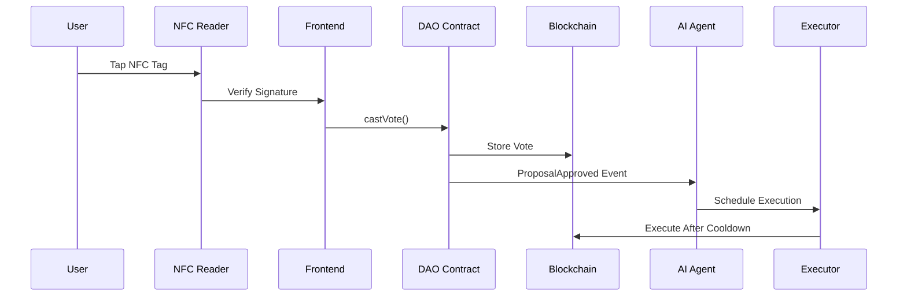

BlockSwarm DAO Framework

[](LICENSE)
[](https://docs.soliditylang.org)
[](https://chain.link)

A decentralized autonomous organization framework combining physical NFC-based voting with AI-powered proposal execution.


## Features

- 🛡️ **Soulbound NFC NFTs** for 1-person-1-vote governance
- 🤖 **AI Agents** for automated proposal execution
- ⛓️ **Hybrid On/Off-Chain** voting mechanisms
- 🔒 **Time-locked Execution** with cooldown periods
- 📊 **Real-time Governance Dashboard**

## Repository Structure

```
BlockSwarm-DAO/
├── contracts/
│   ├── GovernanceNFT.sol           # Soulbound NFC voting token
│   ├── DAOGovernor.sol            # Governance core logic
│   ├── AIExecutor.sol            # Secured AI execution module
│   └── interfaces/                # Contract interfaces
│       └── IChainlinkOracle.sol
├── agents/
│   ├── core/                      # AI agent framework
│   │   ├── agent.py              # Main agent class
│   │   └── nlp_processor.py      # Proposal parser
│   ├── tasks/                    # Predefined agent tasks
│   │   ├── proposal_executor.py
│   │   └── voting_analyzer.py
│   └── config/                   # Agent configurations
│       └── permissions.yaml
├── frontend/
│   ├── public/                   # Static assets
│   └── src/
│       ├── components/           # React components
│       │   ├── NFCDashboard.jsx
│       │   └── ProposalCreator.jsx
│       ├── contracts/            # ABIs and addresses
│       └── services/             # Web3 and AI services
├── scripts/
│   ├── deployment/               # Deployment scripts
│   │   ├── deploy_nft.js
│   │   └── deploy_dao.js
│   └── oracle/                   # Chainlink integration
├── tests/
│   ├── smart_contracts/          # Solidity tests
│   └── agent/                    # Python agent tests
├── docs/
│   ├── ARCHITECTURE.md           # System design
│   └── DEPLOYMENT_GUIDE.md       # Setup instructions
├── .env.example                  # Environment template
├── hardhat.config.js             # Hardhat configuration
├── package.json                  # Node dependencies
├── requirements.txt              # Python dependencies
└── LICENSE
```

## Quick Start

### Prerequisites
- Node.js v18+
- Python 3.10+
- Foundry / Hardhat
- NFC Development Kit (NTAG424 DNA)

### Installation

1. Clone repository:
```bash
git clone https://github.com/your-org/blockswarm-dao.git
cd blockswarm-dao
```

2. Install dependencies:
```bash
# Node.js
npm install

# Python
pip install -r requirements.txt
```

3. Configure environment:
```bash
cp .env.example .env
# Fill in your values
```

### Deployment

1. Deploy NFC NFT contract:
```bash
npx hardhat run scripts/deployment/deploy_nft.js --network sepolia
```

2. Deploy DAO Governor:
```bash
npx hardhat run scripts/deployment/deploy_dao.js --network sepolia
```

3. Start AI Agent:
```bash
python -m agents.core.agent
```

## Usage

### Mint NFC NFT
```javascript
// From admin account
await nftContract.mintWithNFC(
  userAddress,
  nfcHash,
  signature
);
```

### Create Proposal
```javascript
// From frontend
const proposalTx = await daoContract.propose(
  "Transfer 1 ETH to Treasury",
  "0x...targetAddress",
  calldata
);
```

### Vote with NFC
```javascript
// Requires WebNFC browser API
const voteTx = await daoContract.castVote(
  proposalId,
  true, // Support
  nfcSignature
);
```

### Monitor AI Execution
```python
# AI Agent logs
[INFO] Received Proposal #42: Transfer funds
[DEBUG] Forming action plan...
[SUCCESS] Executed proposal 42 at 0x...txHash
```

## Tech Stack

- **Smart Contracts**: Solidity 0.8.20, OpenZeppelin
- **Frontend**: React, ethers.js, WebNFC
- **AI Agents**: Python, Transformers, Web3.py
- **Oracles**: Chainlink
- **Infrastructure**: Hardhat, IPFS, Foundry

## Documentation

- [Architecture Overview](docs/ARCHITECTURE.md)
- [Smart Contract API](docs/SMART_CONTRACTS.md)
- [Agent Framework Guide](docs/AGENT_FRAMEWORK.md)
- [Security Practices](docs/SECURITY.md)

## Contributing

1. Fork the repository
2. Create feature branch: `git checkout -b feature/new-feature`
3. Commit changes: `git commit -m 'Add new feature'`
4. Push to branch: `git push origin feature/new-feature`
5. Submit pull request

## License

MIT License - See [LICENSE](LICENSE) for details

## Disclaimer

**This is experimental software** - Use at your own risk. Always audit contracts before deploying to mainnet.

---

## Visual Guide

### Voting Workflow


### Security Model


---

**Need Help?**  
Open an issue or join our [Discord Server](https://discord.gg/blockswarm)

---
